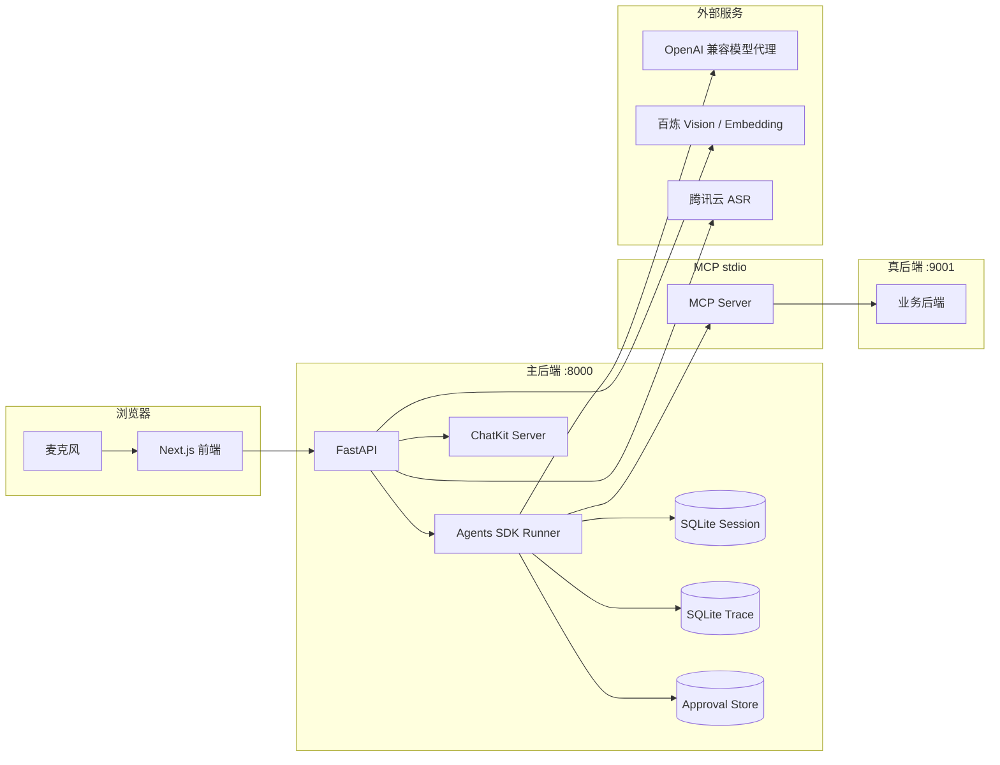

# Agentic Customer Support Platform

面向中文电商场景的多智能体客服平台，基于 [OpenAI Agents Python SDK](https://github.com/openai/openai-agents-python) 与 [ChatKit](https://github.com/openai/chatkit-js) 构建。项目围绕“咨询 -> 检索 -> 处理 -> 审批 -> 追踪”形成可闭环链路，支持会话持久化、Tracing、输入输出护栏、结构化摘要、MCP 后端接入、agents-as-tools 多意图分发和语音输入，可直接用于本地演示与上线前集成验证。

---

## 1. 平台概览



---

## 2. 核心能力

| 能力 | 说明 |
|---|---|
| 多智能体编排 | triage + 专员 agent 协作处理客服请求 |
| 输入护栏 | 相关性检查与越狱防护 |
| 输出护栏 | PII、虚假承诺、品牌中立等约束 |
| 会话持久化 | SQLite 落盘，支持刷新后继续对话 |
| Tracing | 本地追踪与前端面板联动 |
| 结构化摘要 | 自动生成会话摘要 |
| 真后端接入 | 通过 MCP 对接真实业务接口 |
| 多意图分发 | agents-as-tools 将复杂请求拆分处理 |
| 软审批 | 退款、取消、价保等动作进入审批流 |
| 语音输入 | 支持 push-to-talk 语音转写 |

---

## 3. 项目特点

- 面向真实电商客服流程，覆盖售前咨询、订单查询、售后处理和人工交接等关键环节
- 支持完整业务闭环，包括知识检索、工具调用、审批流、工单沉淀和过程追踪
- 前后端、模型调用、MCP 后端、语音输入和 CI 检查均已集成，便于上线前验证
- 通过输入输出护栏、结构化摘要和本地 Trace 降低客服自动化系统的风险与排查成本

---

## 4. 快速启动

### 4.1 凭证准备

后端支持通过环境变量或本地配置文件提供模型、视觉识别和语音识别凭证。

至少需要：

- 一组 OpenAI 兼容模型服务
- `DASHSCOPE_API_KEY`
- 腾讯云 `SecretId` / `SecretKey`

### 4.2 方式一：Docker Compose

```bash
docker compose up --build
```

浏览器打开：

```text
http://localhost:3000
```

### 4.3 方式二：本机启动

后端：

```bash
cd python-backend
python -m venv .venv
.venv\Scripts\activate
pip install -r requirements.txt
python -m uvicorn main:app --host 0.0.0.0 --port 8000
```

前端：

```bash
cd ui
npm install
npm run dev:next
```

浏览器打开：

```text
http://localhost:3000
```

---

## 5. 测试

```bash
cd python-backend
python -m unittest discover -s . -p 'test_*.py'
```

```bash
cd ../ui
npx tsc --noEmit
```

---

## 6. 目录速览

```text
.
├── docs/ROADMAP.md
├── docker-compose.yml
├── .github/workflows/ci.yml
├── python-backend/
│   ├── main.py
│   ├── server.py
│   ├── tracing_store.py
│   ├── jd_realbackend.py
│   ├── jd_mcp_server.py
│   └── ecommerce/
└── ui/
    ├── app/page.tsx
    ├── components/
    └── next.config.mjs
```

---

## 7. 常见问题

- **`PermissionDeniedError: 403 Your request was blocked.`**
  代理网关可能拦截了部分请求头，确认使用的是最新代码。

- **腾讯云 ASR `User is unopened`**
  账号未开通一句话识别能力。

- **`empty transcript`**
  录音时长过短或环境噪声过大。

- **`.agent_sessions.db` / `.agent_traces.db` 删除失败**
  先停止后端进程。

---

## 8. License

MIT
